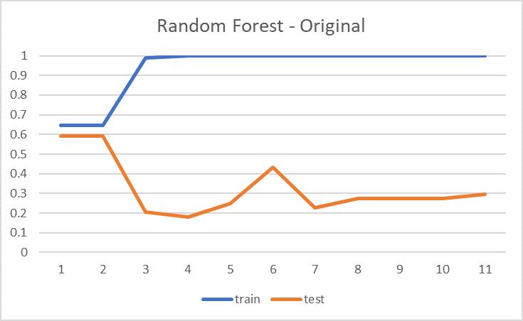

# Project - Machine Learning 2

**Authors:** Luiz PINHEIRO and Matheus MARCONDES

## Problem

Create a model that predicts whether we can issue credit to a client or not.

We are given a dataset of the client characteristics and if the bank issued credit to them.

## Overview of the problem

### What is the objective?

Increase the profit of the bank by issuing credit to a trusted client 

### How will our solution be used?

In summary, our model will be used to detect the trusted clients and 
then make money with them by issuing credit. 

### Type of the problem

Binary classification (Supervised Learning) by using batch learning. 

### How should performance be measured? 

The objective is to maximize our revenue by issuing credit to the clients. In other 
words, it can be seen as finding the maximum of true positives (trusted clients 
predicted as trusted) with few false positives (untrusted clients predicted as trusted).

Since we don't have any information about the amount of credit issue that will be 
issued to the clients, we can consider the revenue obtained by the bank as:

- 1, for each true positives
- -1, for each false positives
- 0 for the negatives.

If we have, for example, 100 clients predicted as positive whose 20 are not trusted, then
the hypothetical revenue of the company is 80 - 20 = 60, according to our performance 
measure. But, if we have 75 positives whose 5 are not trusted, then the revenue will be
70 - 5 = 65, which is better than the first case.

In order to normalize this value, we will divide it by the maximum revenue : 

(TP-FP) / (TP+FN)

### What is the minimum performance we want ?

The baseline performance is zero, which means that we cannot lose money.

And the maximum value we can obtain is 1, which means that we obtained the maximum profit possible.

## Our Resolution
To solve this problem we followed a classical approach: 

1) We studied the problem proposed
2) We studied the given data performing analysis to understand and compare the relevance of the features
3) We did the feature engineering to prepare the data to be modelized
4) We choose some models, we tunned theirs hyperparameters and we compared their performance using our metric

### Feature Engineering

The principals treatment we did in the raw dataset is described below :

- Casting the right type for each features.
- Grouping rare categories into a one typical category.
- Transformation of the datetime features into years/months/days with respect
to a specified date.
- One Hot Encoder for the categorical features.
- Scaling of the numerical features
- Feature selection by using feature importance of random forest.

It is important to highlight here the analysis of the most important feature of our
dataset: months_closed

For months_closed >= 10, we have around 83 % of Y == 1 and 11 % of Y == 0. That is why this feature 
is really important for our model.

### The Models

Since it is a binary classification problem, we choose two of the most classical approaches:
1) RandomForestClassifier
2) LogisticRegressor

### Results

Our model performed the best when we used only one feature (months_closed), below you can see these results for the cross-validation performance and the f1-score:

To see the diference in the performance we plotted the performance (on training and testing) during the evaluation phase for the oversampling and the original sampling, as shown in the two graphics below:

